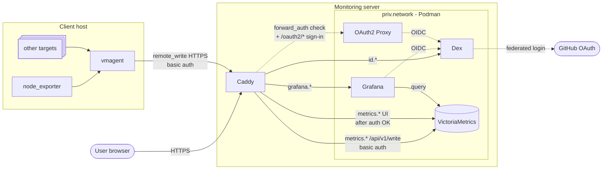

# Ansible playbook for BAR monitoring

This is an [Ansible](https://en.wikipedia.org/wiki/Ansible_(software)) playbook for setting up central BAR monitoring server.

## Architecture

The monitoring server runs a set of Podman containers (managed via Quadlet) on a shared private network, fronted by Caddy. Authentication is handled by Dex (federating to GitHub). Client hosts push metrics to the server over an authenticated HTTPS endpoint.



## Usage

#### Dependencies

Make sure required collections are installed by running:

```
ansible-galaxy collection install -r requirements.yml
```

If you pull repo and there are changes to that file, you need to rerun the command to make sure you pick up latest changes.

#### Vault

We use [Ansible vault](https://docs.ansible.com/projects/ansible/latest/vault_guide/index.html) for management of secrets in playbook. Check out [the official guide](https://docs.ansible.com/ansible/latest/vault_guide/vault_encrypting_content.html#encrypting-files-with-ansible-vault) for how to view and edit them.

For running the playbook against the prod instances, you will need the vault password. You have to run Ansible with `--ask-vault-pass` flag and provide the password when prompted or you can store it in a file (Please put it only in something like [tmpfs](https://en.wikipedia.org/wiki/Tmpfs)!) and point Ansible at it with `--vault-password-file` flag or `ANSIBLE_VAULT_PASSWORD_FILE` environment variable.

#### Running

Currently there is only one playbook that sets up the whole server. You can run it against the `main` instance to check if everything is up to date with:

```
ansible-playbook -l main play.yml --check --diff
```

Then drop the `--check` flag to actually apply the changes.

## Local testing

### Setup

We use Incus for local testing. Make sure you have it installed and initialized following [the official getting started docs](https://linuxcontainers.org/incus/docs/main/tutorial/first_steps/).

To create a new container and initialize it via cloud-init, run the following command:

```
touch .incus-integration-on && \
chmod 0600 test.ssh.key && \
incus launch images:debian/trixie/cloud bar-mon-test < test.incus.yml && \
incus exec bar-mon-test -- cloud-init status --wait
```

Then test that it works for ansible:

```
ansible dev -m shell -a 'uname -a'
```

The test container runs a few different services, and depends on a few `*.bar-mon.local` domain names pointing at the incus container so they are independently routable from web browser. Easiest is to add a new entry in `/etc/hosts` like:

```
{incus_container_ip} id.bar-mon.local grafana.bar-mon.local metrics.bar-mon.local logs.bar-mon.local
```

you can add/update it with:

```
ansible ,localhost -b -K -m lineinfile -a "path=/etc/hosts regexp='.*bar-mon.*' line='$(ansible-inventory --host test | jq -r '.ansible_host') id.bar-mon.local grafana.bar-mon.local metrics.bar-mon.local logs.bar-mon.local'"
```

### Usage

Now you can use all the playbooks and roles as usual, just make sure you are targeting the `dev` inventory group or `test` host. For example:

```
ansible-playbook -l dev play.yml
```

You can ssh into it with something like:

```
ssh -i test.ssh.key ansible@$(ansible-inventory --host test | jq -r '.ansible_host')
```

Or enter directly into root container shell with:

```
incus exec bar-mon-test -- /bin/bash
```

### Cleanup

To stop and remove the container:

```
incus stop bar-mon-test && incus delete bar-mon-test
```
